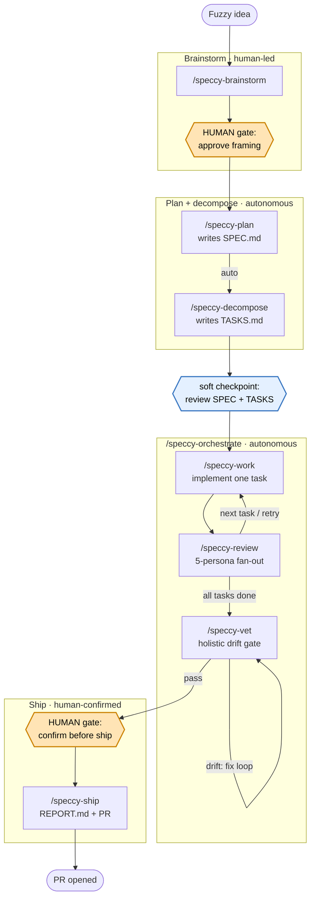

# Speccy

A deterministic feedback engine for spec-driven development with AI
agents.

When humans and AI agents build software together over time, intent and
shipped behaviour drift apart. Small misreadings of intent compound until
what shipped no longer matches what was asked for. Speccy makes the
contract between intent and behaviour **visible**, so the drift becomes
loud the moment it happens.

> **Status:** v1.0.0. Speccy is dogfooded by Speccy itself; its
> implementation history is preserved under `.speccy/archive/`.

---

## The idea

- **Drift made visible, not blocked.** Speccy is a feedback engine, not
  an enforcement system. It tells you what looks off and lets you decide.
  There is no `--strict` mode and no policy file.
- **Deterministic core, intelligent edges.** A thin Rust CLI renders
  prompts, queries workspace state, and runs proof-shape checks. It never
  calls an LLM. The loops, personas, and "what to do next" decisions live
  in the skill layer your agent harness drives.
- **Proof shape, not proof scores.** Every requirement maps to at least
  one check, and every check says what it proves. The CLI flags
  structural breakage; whether a test is meaningful goes to review.
- **Adversarial review catches the drift.** A multi-persona review loop
  (business, tests, security, style, correctness) runs on the same host
  that did the implementation, with state living in markdown the next
  iteration reads.

The full reasoning behind these is in
[`docs/ARCHITECTURE.md`](./docs/ARCHITECTURE.md).

---

## Install

Speccy is not yet published to crates.io, so installation is from source:

```bash
# from a local clone
git clone https://github.com/kvnxiao/speccy
cd speccy
cargo install --path speccy-cli --locked

# or directly
cargo install --git https://github.com/kvnxiao/speccy speccy-cli --locked
```

Confirm the binary is on `PATH`:

```bash
speccy --version
```

The shipped skill packs target two agent harnesses: **Claude Code** and
**Codex**.

---

## How to use

Bootstrapping is two one-time steps:

1. **In the repo (CLI):** run `speccy init` once to scaffold `.speccy/`
   and install the host skill pack into `.claude/` (or `.agents/` for
   Codex).
2. **In your agent harness:** run `/speccy-bootstrap` once. It seeds your
   root `AGENTS.md` with the product north star and a `## Speccy
   conventions` section, so the agent knows when to reach for which skill
   and how the loop runs. Re-run it after a `speccy` upgrade to refresh
   the conventions and pick up any newly shipped skills.

After that, day-to-day work happens **inside your agent harness** as
slash commands. You type a command; the shipped skill invokes the CLI on
your behalf and knows which verbs to call, when, and in what order.

```text
/speccy-brainstorm   atomize a fuzzy idea into first-principle requirements
/speccy-plan         draft SPEC.md from the product north star
/speccy-decompose    break the SPEC into agent-sized tasks (TASKS.md)
/speccy-orchestrate  drive work + review + vet, task by task, until ready to ship
/speccy-ship         write REPORT.md and open the PR
```

The loop has three zones: a human-led planning phase, an autonomous
work-and-review loop in the middle, and a human-confirmed ship at the
end. Planning needs one human approval — the framing — after which
`/speccy-plan` carries straight through `/speccy-decompose` and stops at a
contract checkpoint where you review SPEC + TASKS before the loop starts.
The autonomous zone runs itself and only surfaces to you when a bounded
budget is exhausted (a task that keeps failing review, or a pre-ship drift
check that won't converge).



`/speccy-orchestrate` stops one step short of `/speccy-ship` and asks you,
because shipping pushes a branch and opens a PR — an outward-facing action
that notifies reviewers and triggers CI. Two more recipes round
out the set: `/speccy-amend` for mid-loop SPEC changes, and `/speccy-vet`
for the pre-ship drift check (the orchestrator runs it for you, but it is
runnable on its own).

The phases, gates, and review fan-out are documented in
[`docs/WORKFLOW.md`](./docs/WORKFLOW.md).

---

## What the CLI gives you

The CLI is a thin deterministic core the skills drive for you, so you
rarely call it by hand. The shape worth knowing:

- `speccy init` scaffolds the workspace and copies the host skill pack.
- `speccy status` / `speccy next` report workspace state and the derived
  next action.
- `speccy check` renders the Given/When/Then scenarios for a spec or
  task.
- `speccy verify` is your CI gate (see below).

Every command has stable text output, and a handful carry stable `--json`
envelopes for tooling. The full per-command surface is in
[`docs/CLI.md`](./docs/CLI.md).

---

## CI gate

Add `speccy verify` to your pipeline:

```yaml
- name: speccy verify
  run: speccy verify
```

It exits non-zero when the proof shape is broken (parse failures, missing
required frontmatter, requirements without scenarios, dangling
references, journal-shape violations) and zero otherwise. Spec-hash drift
is a warning, not a failure. It never runs your project tests; your own
test commands run alongside it. `speccy verify` is the only command that
exits non-zero on findings, so drift stays loud while the CLI never
blocks you mid-loop.

---

## It lives in your repo

Everything Speccy installs sits inside your repo. The `.speccy/`
workspace holds your specs; the host skill pack is copied into your local
`.claude/`, `.agents/`, or `.codex/` folder. Nothing is written to a
global skills location.

```text
AGENTS.md            Product north star + conventions (root; CLAUDE.md symlinks here)
.speccy/specs/       One folder per spec: SPEC.md, TASKS.md, journal/, REPORT.md
.speccy/archive/     Shipped specs, relocated out of the hot path
.claude/skills/      Workflow recipes (speccy-plan, -work, -review, ...)
.claude/agents/      Pinned phase workers + reviewer/vet/plan sub-agents
```

The shipped skills and personas are a reasonable starting point, but you
will get better results tuning them to your repo's conventions,
vocabulary, and tooling. Commit those edits and every contributor on the
same harness inherits the tuning, so agent output stays consistent across
the team. To uninstall, delete `.speccy/` and the host skill files and
you are back where you started. The full layout is in
[`docs/SCHEMA.md`](./docs/SCHEMA.md).

---

## Docs

- [`docs/ARCHITECTURE.md`](./docs/ARCHITECTURE.md): design rationale.
  What Speccy is, what it believes, what it deliberately doesn't do.
- [`docs/CLI.md`](./docs/CLI.md): every command, flag, and `--json`
  envelope.
- [`docs/SCHEMA.md`](./docs/SCHEMA.md): file layout, artifact templates,
  element grammars, and the lint registry.
- [`docs/WORKFLOW.md`](./docs/WORKFLOW.md): the loop, the review
  personas, and the per-phase model pins.

---

## License

MIT. See [`LICENSE`](./LICENSE).
